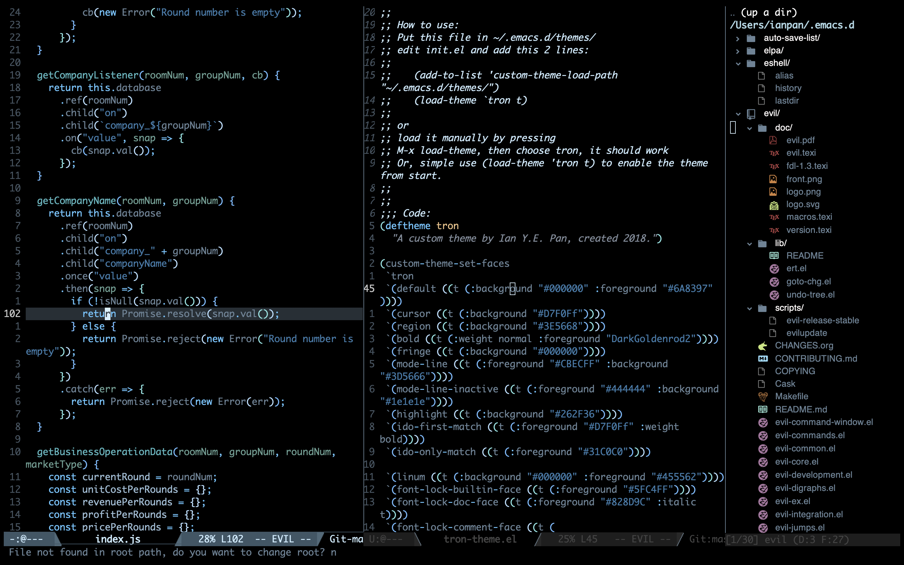
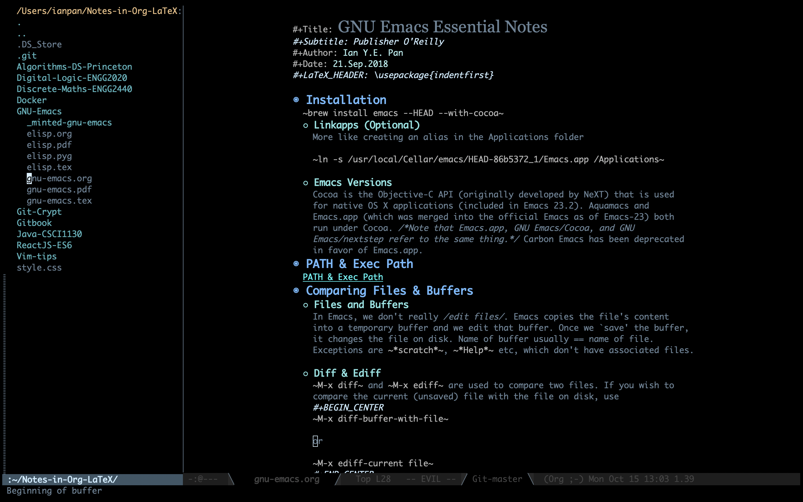

# Emacs Tron Theme

  

Copyright© 2018 Ian Y.E. Pan

Licensed under GNU GPLv3

### Custom Theme inspired by Tron: Legacy

Apart from 'the Emacs scene' in the 2010 Tron film, the colorscheme is
heavily inspired by Base16-Black-Metal, Doom, Grayscale and City Lights.

## Invoking theme:

Simply put this file in "~/.emacs.d/themes/"

Then add these 2 lines in you init file:

    (add-to-list 'custom-theme-load-path "~/.emacs.d/themes/")
    (load-theme `tron t)

You're good to go!

## Screenshots:
### (left to right) JavaScript | Emacs Lisp | NeoTree

 

### (left to right) Dired | Org Mode

 
 

Copyright© 2018 Ian Y.E. Pan

This program is free software: you can redistribute it and/or modify
it under the terms of the GNU General Public License as published by
the Free Software Foundation, either version 3 of the License, or
(at your option) any later version.

This program is distributed in the hope that it will be useful,
but WITHOUT ANY WARRANTY; without even the implied warranty of
MERCHANTABILITY or FITNESS FOR A PARTICULAR PURPOSE.  See the
GNU General Public License for more details.

You should have received a copy of the GNU General Public License
along with this program.  If not, see <https://www.gnu.org/licenses/>.

