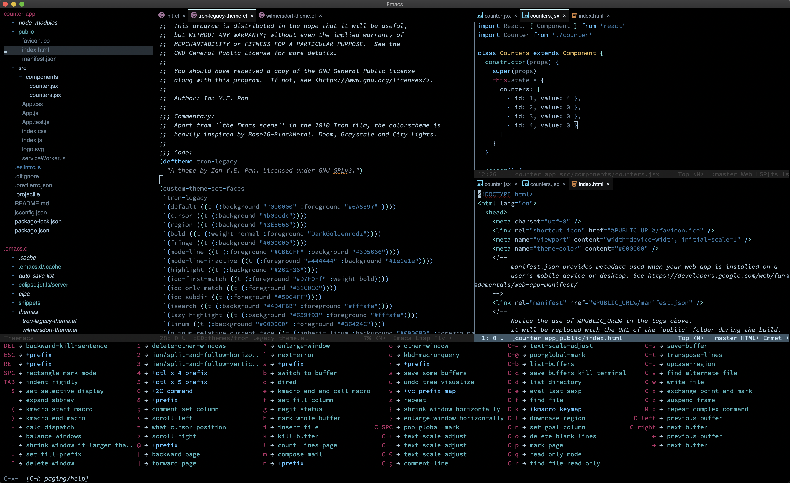
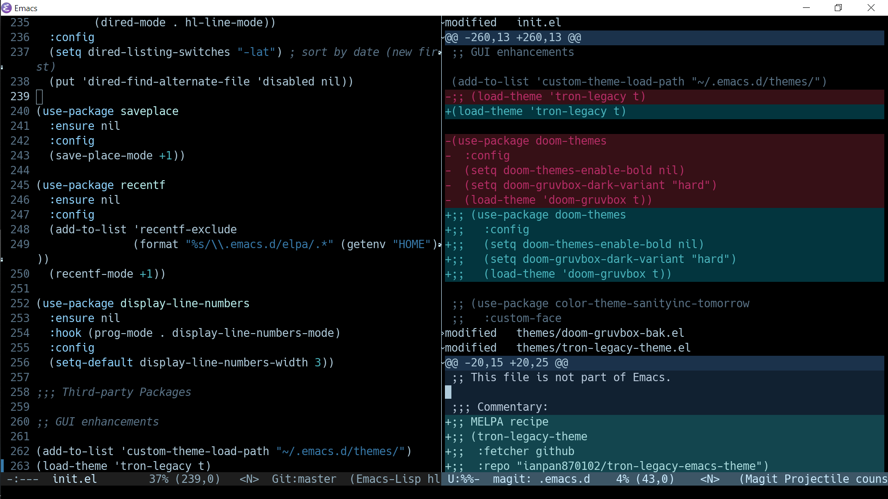
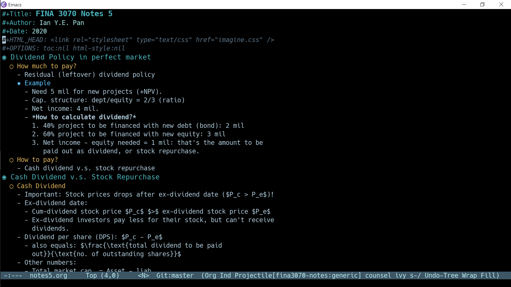
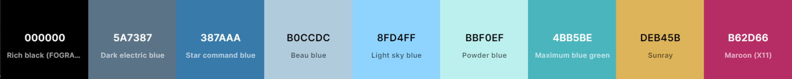

<h3 align="center">Tron Legacy Emacs Theme</h3>
<hr/>


<p align="center">
  
</p>

<p align="center">
<a href="https://github.com/ianpan870102/tron-legacy-emacs-theme"></a>
<a href="https://www.gnu.org/licenses/gpl-3.0"></a>
<a href="https://github.com/ianpan870102/.emacs.d"></a>
<a href="https://github.com/sindresorhus/awesome"></a>
</p>

<br/>

<p align="center">Inspired by Base16-Black-Metal, Grayscale and City Lights.</p>

<p align="center">
  
</p>


### Installing the theme:


#### MELPA (recommended)

`tron-legacy-theme` is now on MELPA as a package (as of 1. June. 2020)! An example use-package declaration:

```emacs-lisp
(use-package tron-legacy-theme
  :config
  (load-theme 'tron-legacy t))
```

If you want to invoke some customization options (more info see below), you should set them "before" you load the theme, like so:

```emacs-lisp
(use-package tron-legacy-theme
  :config
  (setq tron-legacy-theme-vivid-cursor t)
  (load-theme 'tron-legacy t))
```


#### Manual

Download `tron-legacy-theme.el` and put it under `~/.emacs.d/themes/` (or `~/.config/emacs/themes/`), then add these lines to your `init.el`:

```emacs-lisp
(add-to-list 'custom-theme-load-path "~/.emacs.d/themes/")
; or
(add-to-list 'custom-theme-load-path "~/.config/emacs/themes/")

(load-theme 'tron-legacy t)
```

### Customization options:

1. Setting `tron-legacy-theme-dark-fg-bright-comments` to `t` causes the foreground to be dimmed and comments to be brighter. The default value is `nil`.

```emacs-lisp
(setq tron-legacy-theme-dark-fg-bright-comments t)
```

2. Setting `tron-legacy-theme-vivid-cursor` to `t` changes the cursor colour to bright golden, making it easier to spot.

```emacs-lisp
(setq tron-legacy-theme-vivid-cursor t)
```

3. Setting `tron-legacy-theme-softer-bg` to `t` changes the background colour to a dark gunmetal grey, instead of the default pure black.

```emacs-lisp
(setq tron-legacy-theme-softer-bg t)
```

### Screenshots of various modes:

<p align="center">
<!--  -->




</p>

<br>

### Main colour palette:


<p align="center">

</p>

<br>


Copyright© 2018-2020 Ian Y.E. Pan

This program is free software: you can redistribute it and/or modify
it under the terms of the GNU General Public License as published by
the Free Software Foundation, either version 3 of the License, or
(at your option) any later version.

This program is distributed in the hope that it will be useful,
but WITHOUT ANY WARRANTY; without even the implied warranty of
MERCHANTABILITY or FITNESS FOR A PARTICULAR PURPOSE.  See the
GNU General Public License for more details.

You should have received a copy of the GNU General Public License
along with this program.  If not, see <https://www.gnu.org/licenses/>.
