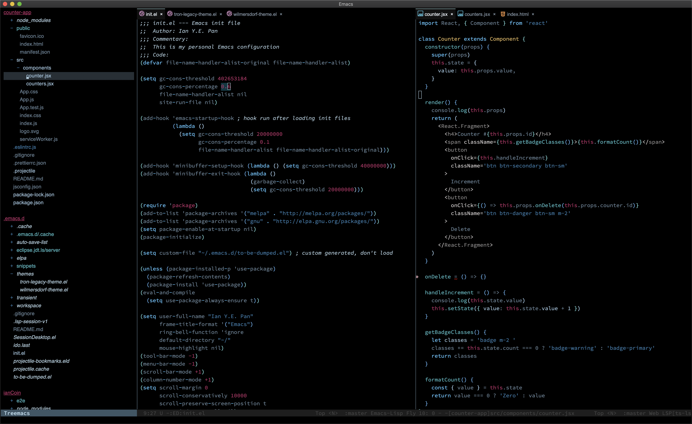

<h3 align="center">Tron Legacy Emacs Theme</h3>
<hr/>


<p align="center">
  
</p>

<p align="center">
<a href="https://github.com/ianpan870102/tron-legacy-emacs-theme"></a>
<a href="https://www.gnu.org/licenses/gpl-3.0"></a>
<a href="https://github.com/sindresorhus/awesome"></a>
</p>

<br/>

<p align="center">Inspired by Base16-Black-Metal, Doom, Grayscale and City Lights.</p>


### Invoking the theme:

Simply put this file in "~/.emacs.d/themes/"

Then add these 2 lines in you init file:

```
    (add-to-list 'custom-theme-load-path "~/.emacs.d/themes/")
    (load-theme `tron-legacy t)
```

<br>
<br>

### Screenshots:

(left to right) Treemacs | Emacs Lisp | JSX



<br>

(left to right) Treemacs | Emacs Lisp | JSX/HTML | Which-key


<br>
<br>


Copyright© 2018 Ian Y.E. Pan

This program is free software: you can redistribute it and/or modify
it under the terms of the GNU General Public License as published by
the Free Software Foundation, either version 3 of the License, or
(at your option) any later version.

This program is distributed in the hope that it will be useful,
but WITHOUT ANY WARRANTY; without even the implied warranty of
MERCHANTABILITY or FITNESS FOR A PARTICULAR PURPOSE.  See the
GNU General Public License for more details.

You should have received a copy of the GNU General Public License
along with this program.  If not, see <https://www.gnu.org/licenses/>.
