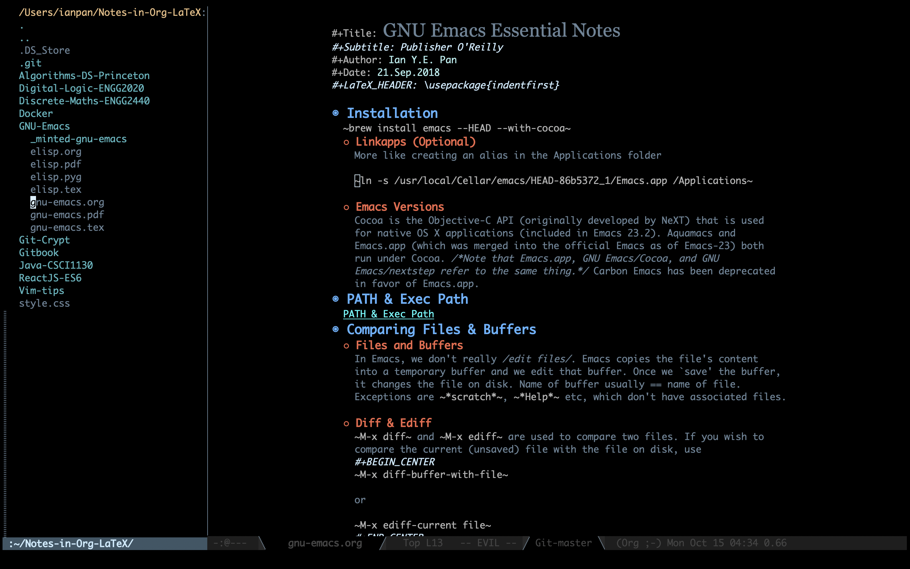

# Emacs Tron Theme
### Custom Theme inspired by Tron: Legacy

Apart from 'the Emacs scene' in the 2010 Tron film, the colorscheme is
heavily inspired by Solarized Dark, Doom, Base16-Ocean and City Lights.

## Invoking theme:

Put this file in "~/.emacs.d/themes/"

Add these 2 lines in you init file:

    (add-to-list 'custom-theme-load-path "~/.emacs.d/themes/")
    (load-theme `tron t)

## Screenshots:

